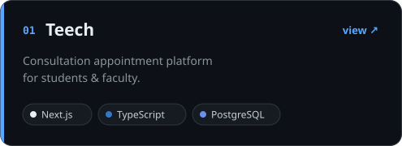
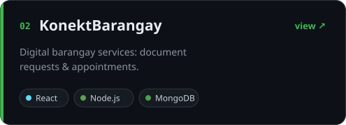
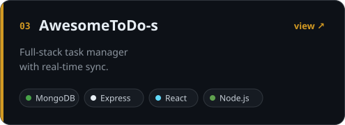
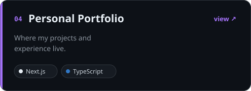

<!-- ░░ HEADER ░░ -->

<!-- ░░ ABOUT ░░ -->

<!-- ░░ TECH STACK (animated) ░░ -->
<h3 align="center">🛠 Tech I work with</h3>

<!-- ░░ STATS (full width) ░░ -->
<h3 align="center">📊 GitHub at a glance</h3>

  
  

  

  

<!-- ░░ SNAKE ░░ -->

  <picture>
    <source media="(prefers-color-scheme: dark)" srcset="./assets/snake-dark.svg" />
    <source media="(prefers-color-scheme: light)" srcset="./assets/snake-light.svg" />
    
  </picture>

<!-- ░░ PROJECTS (2x2 grid) ░░ -->
<h3 align="center">🚀 Featured projects</h3>

  
  
  
  

  Live demos →
  <a href="https://teech-app.vercel.app">Teech</a> ·
  <a href="https://konektbarangay.vercel.app">KonektBarangay</a> ·
  <a href="https://awesometodo-s-1.onrender.com/">AwesomeToDo-s</a> ·
  <a href="https://carldev.vercel.app">Portfolio</a>

<!-- ░░ FOOTER ░░ -->

<i>"final fix" → "final fix for real" → "ok THIS is the final fix"</i>

 ⭐ <b>Like something here? Drop a star!</b> ⭐

